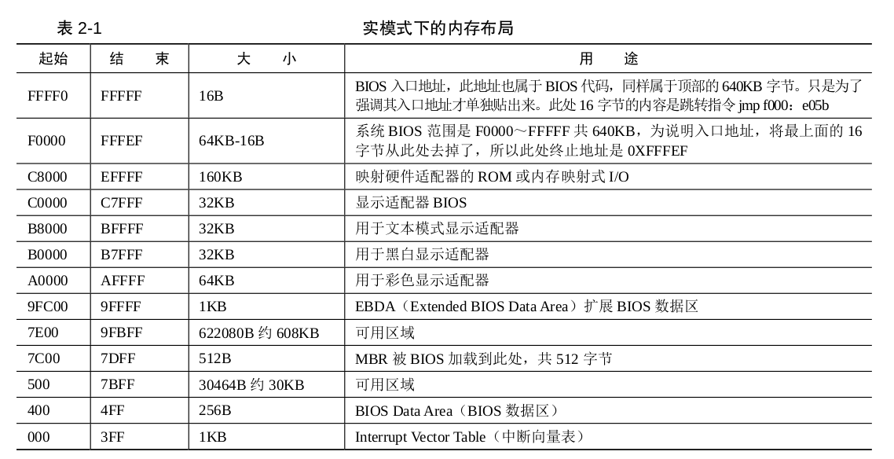

实模式下内存布局

硬件完成内存和地址的映射，比如BIOS的ROM 被映射在低端 1MB 内存的顶部，即地址 0xF0000～0xFFFFF 处。要访问此处的地址便是访问了 BIOS，这个映射是由硬件完成的。

地址总线不止映射内存，也会映射一些外设

在开机的一瞬间，CPU 的 cs：ip 寄存器被强制初始化为 0xF000：0xFFF0。进入bios执行。0xFFFF0一般是一条跳转指令，跳转到BIOS的低地址开始执行jmp far f000：e05b，即跳向了 0xfe05b 处，这是 BIOS 代码真正开始的地方。

BIOS 检测内存、显卡等外设信息，当检测通过，并初始化好硬件后，开始在内存中 0x000～0x3FF 处建立数据结构，中断向量表 IVT 并填写中断例程。
