### 实模式下的 call

- 16 位实模式相对近调用	call + 标号/立即数

call near prog_name

call near near_proc

名字上和“近”有关的调用就可以用关键字 near 来修饰，near 表示在内存或寄存器中取 2 字节，这是一
种数据类型转换，和数据类型伪指令 word 作用相同。near 可以省略，nasm 编译器默认在地址处取 2 字节。

用跳转后的目标地址减去当前地址，所得的差再减去此种 call指令的大小3，最终的结果便是此 call相对近转移的操作数。cpu使用时将该操作数恢复为绝对地址，即IP+3+call相对近转移的操作数

call 指令只要保留 IP 寄存器的值就好了，将其压入栈后，再用新的偏移地址替换 IP 的值。

- 16 位实模式间接绝对近调用

指令的一般形式是“call 寄存器寻址”或“call 内存寻址”，如 call ax，call [0x1234]

可以用 near。near 也可以省略。

call 指令只要保留 IP 寄存器的值就好了，将其压入栈后，再用新的偏移地址替换 IP 的值。

- 16 位实模式直接绝对远调用

call far 段基址（立即数）：段内偏移地址（立即数）

先把老的 CS 寄存器压入栈，再把老的 IP 寄存器压入栈后，用新的 CS 和 IP 寄存器替换。

- 16 位实模式间接绝对远调用

不支持寄存器寻址，只支持内存寻址，即段基址和段内偏移地址在内存中。

call far 内存寻址，如 call far [bx],call far [0x1234]

先把老的 CS 寄存器压入栈，再把老的 IP 寄存器压入栈中保存起来，再用新的段基址替换 CS，新的段内偏移地址替换 IP。

如果 call 不加 far 的话，就同间接绝对近调用一样了。

### 实模式下的 jmp

- 16 位实模式相对短转移

指令格式是 jmp short 立即数地址，此处的立即数地址也可以是标号。

相对短转移的机器码大小是 2 字节，操作码和操作数各1字节，跳转的范围只能是 1 字节有符号数所表示的范围，即-128～127。

用跳转后的目标地址减去当前地址，所得的差再减去此种 jmp 指令的大小 2 字节，最终的结果便是此 jmp相对短转移的操作数。cpu使用时将该操作数恢复为绝对地址，即当前地址+2+jmp相对近转移的操作数

关键字 short 是指明让 nasm 编译器将 jmp 编译为相对短转移的形式，如果条件不满足 short 的要求，即操作数大小不满足-128～127 的范围，则会编译失败。此参数可以省略，但省略后并不能保证 nasm依然把它编译成相对短转移的形式，也许能，也许不能。nasm 编译器来自动判断，用 short，还是 near。可能会编译成相对近转移

- 16 位实模式相对近转移

指令格式是 jmp near 立即数地址

操作数等于目标地址减去当前指令地址后所得的差，再减去机器码大小。相对近转移的机器码是 3 字节，所以操作数=目标地址-当前指令地址-3。绝对地址=操作数+IP寄存器的值+3。

按照目前 2.10.07 版本的 nasm，如果超过了 16 位有符号数的范围-32768～32767，编译器并不会报错，只是会将超过 16 位的部分忽略，只保留 16 位的结果。

- 16 位实模式间接绝对近转移

指令格式是 jmp near 寄存器寻址，或者 jmp near 内存寻址。

- 16 位实模式直接绝对远转移

指令格式为 jmp 立即数形式的段基址：立即数形式的段内偏移地址。例如 jmp 0:0x900

- 16 位实模式间接绝对远转移

需要在指令中用关键字 far，即前两个字节是段内偏移地址，后两个字节是段基址。

其指令格式是：jmp far 内存寻址。

### 标志寄存器 flags

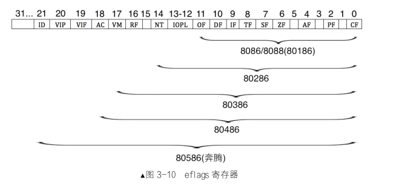

第 0 位的是 CF 位，即 Carry Flag，意为进位。运算中，数值的最高位有可能是进位，也有可能是借位，所以 carry 表示这两种状态。不管最高位是进位，还是借位，CF 位都会置 1，否则为 0。

第 1、3、5、15 位没有专门的标志位，空着占位用。

第 2 位为 PF 位，即 Parity Flag，意为奇偶位。用于标记结果低 8 位中 1 的个数，如果为偶数，PF 位为 1，否则为 0。常用于数据传输开始时和结束后的对比，判断传输过程中是否出现错误。

第 4 位为 AF 位，即 Auxiliary carry Flag，意为辅助进位标志，用来记录运算结果低 4 位的进、借位情况，即若低半字节有进、借位，AF 为 1，否则为 0。

第 6 位为 ZF 位，即 Zero Flag，意为零标志位。若计算结果为 0，此标志为 1，否则为0。
第 7 位为 SF 位，即 Sign Flag，意为符号标志位。若运算结果为负，则 SF 位为 1，否则为0。

第 8 位为 TF 位，即 Trap Flag，意为陷阱标志位。此位若为 1，用于让 CPU 进入单步运行方式，若为0，则为连续工作的方式。平时我们用的 debug 程序，在单步调试时，原理上就是让 TF 位为 1。可见，软件上的很多功能，必须有硬件的原生支持才能得以实现。
第 9 位为 IF 位，即 Interrupt Flag，意为中断标志位。若 IF 位为 1，表示中断开启，CPU 可以响应外部可屏蔽中断。若为 0，表示中断关闭，CPU 不再响应来自 CPU 外部的可屏蔽中断，但 CPU 内部的异常还是要响应的，因为它关不住。
第 10 位为 DF 位，即 Direction Flag，意为方向标志位。此标志位用于字符串操作指令中，当 DF 为1 时，指令中的操作数地址会自动减少一个单位，当 DF 为 0 时，指令中的操作数地址会自动增加一个单位，意即给地址的变化提供个方向。其中提到的这个单位的大小，取决于用什么指令。
第 11 位为 OF 位，即 Overflow Flag，意为溢出标志位。用来标识计算的结果是否超过了数据类型可表示的范围，若超出了范围，就像水从锅里溢出去了一样。若 OF 为 1，表示有溢出，为 0 则未发生溢出。专门用于检测有符号数运算结果是否有溢出现象。
以下标志位仅在 80286 以上 CPU 中有效。相对于 8088，它支持特权级和多任务。
第 12～13 位为 IOPL，即 Input Output Privilege Level，这用在有特权级概念的 CPU 中。有 4 个任务特权级，即特权级 0、特权级 1、特权级 2 和特权级 3。故 IOPL 要占用 2 位来表示这 4 种特权级。
第 14 位为 NT，即 Nest Task，意为任务嵌套标志位。8088 支持多任务，一个任务就是一个进程。当一个任务中又嵌套调用了另一个任务（进程）时，此 NT 位为 1，否则为 0。
以下标志位仅用于 80386 以上的 CPU。
第 16 位为 RF 位，即 Resume Flag，意即恢复标志位。该标志位用于程序调试，指示是否接受调试故障，它需要与调试寄存器一起使用。当 RF 为 1 时忽略调试故障，为 0 时接受。
第 17 位为 VM 位，即 Virtual 8086 Model，意为虚拟 8086 模式。这是实模式向保护模式过渡时的产物，现在已经没有了。CPU 有了保护模式后，功能更加强大了，但为了兼容实模式下的用户程序，允许将此位置为 1，这样便可以在保护模式下运行实模式下的程序了。实模式下的程序不支持多任务，而且程序中的地址就是真实的物理地址。所以在保护模式下每运行一个实模式下的程序，就要为其虚拟一个实模式环境，故称为虚拟模式。
以下标志位仅用于 80486 以上的 CPU。
第 18 位为 AC 位，即 Alignment Check，意为对齐检查。什么是对齐呢？是指程序中的数据或指令其内存地址是否是偶数，是否是 16、32 的整数倍，没有余数，这样硬件每次对地址以自增地方式（每次自加 2、16、32 等）访问内存时，自增后的地址正好对齐数据所在的起始地址上，这就是对齐的原理。对齐并不是软件逻辑中的要求，而是硬件上的偏好，如果待访问的内存地址是 16 或 32 的整数倍，硬件上好处理，所以运行较快。若 AC 位为 1 时，则进行地址对齐检查，为 0 时不检查。
以下标志位只对 80586（奔腾）以上 CPU 有效。
第 19 位为 VIF 位，即 Virtual Interrupt Flag，意为虚拟中断标志位，虚拟模式下的中断标志。
第 20 位为 VIP 位，即 Virtual Interrupt Pending，意为虚拟中断挂起标志位。在多任务情况下，为操作系统提供的虚拟中断挂起信息，需要与 VIF 位配合。
第 21 位为 ID 位，即 Identification，意思为识别标志位。系统经常要判断 CPU 型号，若 ID 为 1，表示当前 CPU 支持 CPU id 指令，这样便能获取 CPU 的型号、厂商等信息。若 ID 为 0，则表示当前 CPU 不支持 CPU id 指令。
其余剩下的 22～31 位都没有实际用途，纯粹是占位用，为了将来扩展。

### 有条件转移

格式为 jxx 目标地址。若条件满足则跳转到目标地址，否则顺序执行下一条指令。

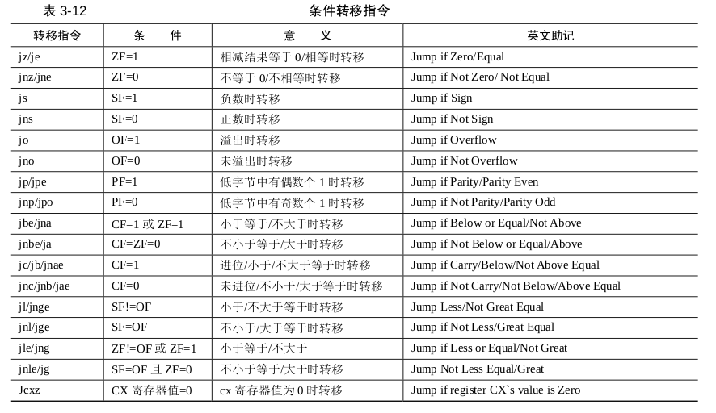

a	表示 above
b	表示 below
c	表示 carry
e	表示 equal
g	表示 great
j	表示 jmp
l	表示 less
n	表示 not
o	表示 overflow
p	表示 parity

## 让我们直接对显示器说点什么吧

### CPU 如何与外设通信—IO 接口

CPU 用的信号都是 TTL 电平，外设大多数都是机电设备，机电设备可不能用 TTL 电平驱动，CPU 系统总线上传送的都是并行数据（所以你听到的都是 8 位、16 位、32 位 CPU……），外设可是并行、串行都有，还得转换格式，想想就麻烦啊。所以在中间加了一层，它的作用就是在 CPU 和外设之间相互做协调转换，如 CPU 和外设速度不匹配，CPU 和外设信号不通用。如果是串行设备，CPU 就同串行接口通信，把数据发给它后，数据再经由串行接口发给串行设备，串行设备有了反馈后，把数据发送给串行接口，再经串行接口返回给 CPU，并行设备也是如此。

IO 接口的功能：

1．设置数据缓冲，解决 CPU 与外设的速度不匹配

2．设置信号电平转换电路

3．设置数据格式转换

外设是多种多样的，输出的信息可能是数字信号、模拟信号等，而 CPU 只能处理数字信号。数字信号需要经过数/模转换（D/A）成模拟量才能被送到外设以驱动硬件，模拟量也同样需要经过模/数（A/D）转换成数字量才能被 CPU 处理。所以接口电路中需要包括 A/D 转换器和 D/A 转换器。另外，即使双方使用的都是数字信号，这也牵涉到格式和字长的问题，如 CPU 使用的是 8 位、16 位或 32 位并行数据，而外设使用并行或串行数据都有可能，所以 IO 接口中必须能够识别格式并且转换成对方需要的形式才行。

4．设置时序控制电路来同步 CPU 和外部设备

5．提供地址译码

南桥用于连接 pci、pci-express、AGP 等低速设备，北桥用于连接高速设备，如内存。

在南桥内部集成了一些 IO 接口，如并口硬盘 PATA（就是我们平时所说的 IDE 硬盘）
、串口硬盘 SATA、USB、PCI 设备、电源管理等接口。

为了支持这些非必要的设备（当然主要是为了方便扩展，不易扩展的产品意味着从出生那天就开始走向灭亡），南桥提供了专门用于扩展的接口，这就是 PCI 接口。在主板上有很多插槽，它们就是预留的 pci接口，pci 设备可以即插即用。很多 pci 设备都可以连接上来，所以这条延长的 PCI 接口便成了 PCI 总线。

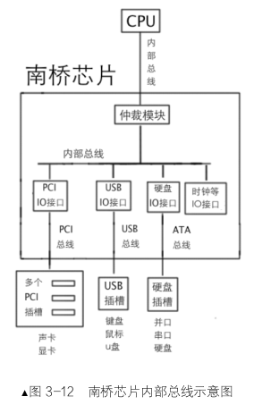

CPU通过寄存器和IO设备通信，些寄存器位于 IO 接口中，为了区别于 CPU 内部的寄存器，IO 接口中的寄存器就称为端口。

IO 接口是连接 CPU 和硬件的桥梁，一端是 CPU，另一端是硬件。

如何访问到端口呢？

1. 映射到内存
2. 独立编址，把所有端口从 0 开始编号，位于一个 IO 接口上的所有端口号都是连续的。

IA32 体系系统中，因为用于存储端口号的寄存器是 16 位的，所以最大有 65536 个端口，即 0～65535。

要是通过内存映射，端口就可以用 mov 指令来操作。独立编址使用in 和 out。

in 指令用于从端口中读取数据，其一般形式是：
（1）in al, dx；
（2）in ax, dx。

al 和 ax 用来存储从端口获取的数据，dx 是指端口号。这是固定用法，只要用 in 指令，源操作数（端口号）必须是 dx，而目的操作数是用 al，还是 ax，取决于 dx 端口指代的寄存器是 8 位宽度，还是 16 位宽度。

out 指令用于往端口中写数据，其一般形式是：

（1）out dx, al；
（2）out dx,ax；
（3）out 立即数, al；
（4）out 立即数, ax。

这和 in 指令相反，in 指令的源操作数是端口号，而 out 指令中的目的操作数是端口号。

总结一下 in 和 out 指令共性：

（1）在以上两个指令中，dx 只做端口号之用，无论其是源操作数或目的操作数。
（2）in 指令从端口读数据，可以认为端口是数据源，所以端口出现在“源操作数”的位置。读出来的数据要有个“目的地”来存放，所以 in 指令中存放数据的地方出现在“目的操作数”位置。out 指令是把数据写入端口指向的寄存器，在这里，端口是数据的“目的地”
，所以端口出现在目的操作数的位置。待写入的数据总该有个“来源”，所以 out 指令中的“源操作数”是数据来源。
在以上的两个指令中，端口号和数据的位置，取决于它们各自的角色是源操作数，还是目的操作数。
（3）在以上两个指令的两个操作数中，无论是对于源操作数，还是目的操作数，除端口号外，那个作为数据的操作数（in 指令中作为数据目的地，out 指令中作为数据源），一律用 al 寄存器存储 8 位宽度的数据，用 ax 寄存器存储 16 位宽度的数据，至于用 al，还是 ax 存数据，要看端口指向的寄存器宽度是多少，它要和端口寄存器的位宽保持一致，不能丢失数据精度。
（4）in 指令中，端口号只能用 dx 寄存器。
（5）out 指令中，可以选用 dx 寄存器或立即数充当端口号。

### 显卡概述

自从几年前 AMD 把 ATI 收购之后，市面上的显卡就分为两大类了，A 卡和 N 卡。A 卡是指以 AMD 为阵营的显卡厂商，N 卡是以 nvidia 为阵营的显卡厂商。大家平时见到的七彩虹、技嘉、昂达之类的显卡，它们用的核心要么是 A 卡，要么是 N 卡，有的厂商两个核心都用，开发各自的版本。他们不自己研发 GPU（显卡的 CPU 称为 GPU），只是在人家的基础上做本地化开发。这种关系就像安卓手机和安卓原生系统一样。

显卡是 pci 设备，所以是安装在主板上 pci 插槽上的，pci 总线是共享并行架构，并行数据就要保证数据发送后必须同时到达目的地，因为这关系到数据的顺序，不能发过去后成一团乱麻。例如 8 位并行总线就需要同时发送这 8 位，接收方也要同时接收这 8 位才行。虽然貌似并行传输是高效的，但对于要保证同时接收 n 位数据，这是有困难的，随着并行数据的位宽越来越大，这种困难也越来越明显。于是串行传输很好地解决了这一问题，一次只发一位，这样顺序问题解决了，数据到目的地看再组合到一起就成了。于是就有了 PCI Express 总线，这就是串行设备，简称 pcie。现在的显卡都是串口的了，包括上面说的 A卡和 N 卡。

### 显存、显卡、显示器

为了能够看到图像，我们需要显示器。无论是哪种显示器，它都是由显卡来控制的。无底是哪种显卡，它提供给我们的可编程接口都是一样的：IO 端口和显存。

显存是由显卡提供的，它是位于显卡内部的一块内存，所以它称为显存。有的标明了 DDR 512M，有的则声称是 DDR2 1G。这指的就是显存大小。显卡的工作就是不断地读取这块内存，随后将其内容发送到显示器。

能在显示器上见到的各种色彩斑斓的图像，说明显卡可以让显示器工作在图形模式，能够在显示器上看到 Linux 终端上的黑屏白字，说明显卡可以让显示器工作在字符模式。屏幕是由密密麻麻的像素组成的，显存中的每一位都对应屏幕上的一个像素点。

按理说，显存中的一位对应一个像素，该位要么是 0，要么是 1，如果让它显示颜色，一个像素顶多显示黑白两色啊，它是如何显示彩色的呢？是啊，一位只能显示两种颜色，看来只有增加位数来达到彩色的效果了。各位肯定听说过24 位真彩色吧，没听过也没关系，就当您听过了，哈哈，其实 24 位真彩色就是用 24 个 bit 表示一个颜色，也就是 3 字节的数据量来表示一种颜色。能表示多少种颜色呢？2 的 24 次方等于 16777216 种。

在黑白图形模式中，显存位与屏幕像素是 1 对 1 的，因为只有两种颜色，所以只要显存中的对应位置为 1，屏幕上的相应像素就被点亮，呈现的是白色。若该位为 0，该像素就不会被点亮。

显示器分不清楚给它的数据是文本，还是图像，在它眼里全都是图像，粒度更细致点来说，全是像素信息，即像素的位置及像素的颜色。对于图像的输出，最直观的想法是：人们想输出什么图像就是计算出要将哪些像素点亮。这简短的一句话，有没有让您心中仿佛有一万只草泥马奔腾而过？什么，没有？那您帮我输出爱因斯坦的肖像给我看，注意，我要看清他的头发。现在草泥马是两万只了？听上去这种用像素拼凑图像的方法真的不亚于愚公移山。

计算机的发明是为了解决问题，而不是带来问题，聪明的工程师当然有更人道的方法，解决问题的方式是一个字符对应一字节的编码，只要往显存中写入这个编码，显卡就知道这是要打印此字符，由它帮你完成像素的拼凑。比如字符 A 的编码就是 0x41，在它后面的字符 B 的编码增加 1，即 0x42。

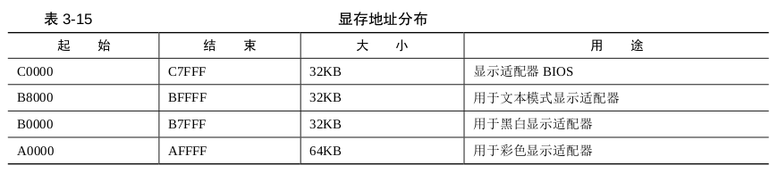

显卡支持三种模式，文本模式、黑白图形模式、彩色图形模式。

地址总线的范围不只是主板上插的内存条的容量，内存条只是地址总线所能达到的范围中的一小部分。指令中所需的任何一个地址，都是地址总线帮咱们去寻址的。地址只是个数字，地址总线把此数字指向哪个存储介质，此地址就落到哪个介质上的某个存储单元中。地址指向哪里，最终是地址总线说了算。如果有同学误以为访问某个 rom 的地址，是先访问到我们的内存条后，再由计算机内的某种神奇力量将其映射到该 rom，这就不对了。

从起始地址 0xB8000 到 0xBFFFF，这片 32KB 大小的内存区域是用于文本显示。我们往 0xB8000处输出的字符直接会落到显存中，显存中有了数据，自然显卡就将其搬到显示器屏幕上了。

显卡的文本模式也是分为多种模式的，用“列数*行数”来表示，如 80 * 25，40 * 25，80 * 43 或者 80 * 50，它们的乘积是整个屏幕上可以容纳的字符数。不同的模式可容纳的字符数不同，如 80 * 25 表示一行 80 个字符，共 25 行。显卡在加电后，默认就置为模式 80 * 25，也就是一屏可以打印 2000 个字符。

显存是从 0xB8000 到 0xBFFFF，范围是 32KB，一屏可以显示 2000 个字符，显示器上的每个字符占 2 字节大小，故每屏字符实际占用 4000 字节。这样，我们的 32KB 的显存可以容纳 32KB/4000B 约等于 8 屏的数据。所以您懂了为什么 Linux 可以用 alt + Fn 键实现 tty 的切换，当然这只是原理，具体的实现要涉及到显卡的寄存器设置。

屏幕上每个字符的低字节是字符的 ASCII 码，高字节是字符属性元信息。在高字节中，低 4 位是字符前景色，高 4 位是字符的背景色。颜色用 RGB 红绿蓝三种基色调和，第 4 位用来控制亮度，若置 1 则呈高亮，若为 0 则为一般正常亮度值。第 7 位用来控制字符是否闪烁（不是背景闪烁）。

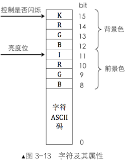

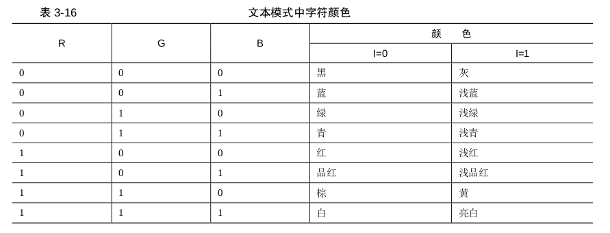

## bochs 调试方法

### bochs 一般用法

由于它是虚拟机，所以支持硬件级别上的调试。
bochs 的硬件调试体现在：
（1）调试时可以查看页表、gdt、idt 等数据结构；
（2）可以查看栈中数据；
（3）可以反汇编任意内存；
（4）实模式、保护模式互相变换时提醒；
（5）中断发生时提醒。

直接键入 help 会显示帮助信息。

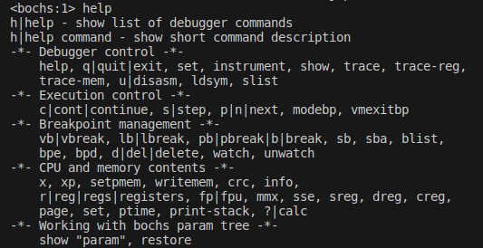

大体上 bochs 的调试命令分为“Debugger control”类、“Execution control”类、“Breakpoint management”类、“CPU and memory contents”类。

“help+命令”，可以显示命令的简短描述信息。

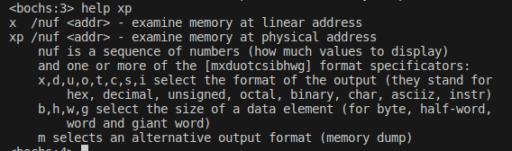

bochs 中用到的“字”并不是 2 字节，而是 4 字节。在图中，提示用 b,h,w,g来选择一个“显示单元”的大小。例如 b 是指一字节。h 是指半个字，2 个字节。w 是指一个字，4 个字节。g 是指双字，8 字节。用 xp 或 x 指令查看内容是以“显示单元”为单位，不是以字节。所以如果不指定数据单位大小，默认以 4 字节为单位来显示。例如 xp 0x7c00，将显示从 0x7c00 开始的 4 个字节。

bochs 中支持八进制、十进制、十六进制的数字。八进制按照以 0 开头的写法即可，十进制自然不用
多说，对于十六进制却有点限制，只支持 0x 前缀的形式，不支持 h 后缀的形式。如：
八进制：011
十进制：11
十六进制：0x11

继续看 xp 指令“xp /nuf < addr >”，nuf 是指一个数字序列，这是三个参数，n 用来分别指定要显示的“显示单元”数，u 指“显示单元”大小，f 是指要用哪种进制显示。最终要显示几个字节，是以“显示单元大小 u*显示单元个数 n”来决定的。addr 可以是以上三种进制的数字。

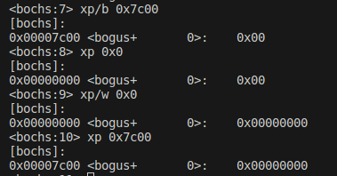

在“Debugger control”类中，有个命令 U，它用来将内存数据反汇编成指令。咱们看一下此命令的帮助。help u 回车后效果如图 3-21 所示。

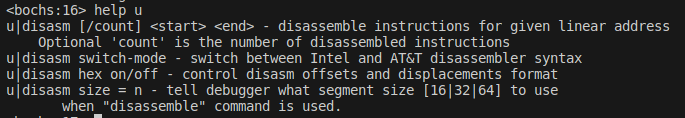

照上面提到的几大类，对常用的调试指令做个大概的介绍。

- “Debugger control”类

q|quit|exit，左边三个命令任意一个都能退出调试状态，关闭虚拟机，一般用 q 最简单。
set 是指令族，咱们通常用 set 设置寄存器的值，这个较常用。
（1）例如 set reg = val。可以设置的寄存器包括通用寄存器和段寄存器。
（2）也可以设置每次停止执行时，是否反汇编指令：set u on|off。
show 是指令族，有很多子功能，咱们常用的就下面这 3 个。
1．show mode
每次 CPU 变换模式时就提示，模式是指保护模式、实模式，比如从实模式进入到保护模式时会有提示。
2．show int
每次有中断时就提示，同时显示三种中断类型，这三种中断类型包括“softint”、“extint”和“iret”。
可以单独显示某类中断，如执行 show softint 只显示软件主动触发的中断，show extint 则只显示来自外部设备的中断，show iret 只显示 iretd 指令有关的信息。
3．show call
每次有函数调用发生时就会提示。
traceon|off 如果此项设为 on，每次执行一条指令，bochs 都会将反汇编的代码打印到控制台，这样在单步调试时免得看源码了。
u|disasm [/num] [start] [end]
将物理地址 start 到 end 之间的代码反汇编，如果不指定地址，则反汇编 EIP 指向的内存。num 指定反汇编的指令数。
setsize = 16|32|64 在使用反汇编命令时，用来告诉调试器段的大小。
set 指令也会设置在停止时是否反汇编命令。前面 set 命令中有说过。
ctrl+c 中断执行，回到 bochs 控制台。

- “Execution control”类

c|cont|continue，左边列出的三个命令都意为向下持续执行，若没断点则一直运行下去。最常用的是 c。
s|step [count] 执行 count 条指令，count 是指定单步执行的指令数，若不指定，count 默认为 1。此指令若遇到函数调用，则会进入函数中去执行。最常用的是 s。
p|n|next 执行 1 条指令，若待执行的指令是函数调用，不管函数内有多少指令，把整个函数当作一个整体来执行。最常用的是 n。

- “Breakpoint management”类

以地址打断点：
vb|vbreak [seg：off] 以虚拟地址添加断点，程序执行到此虚拟地址时停下来，注意虚拟地址是“段：段内偏移”的形式。最常用的是 vb。
lb|lbreak [addr]以线性地址添加断点，程序执行到此线性地址时停下来。最常用的是 lb。
pb|pbreak|b|break [addr]以物理地址添加断点。程序执行到此物理地址时停下来。b 比较常用。

以指令数打断点：
sb [delta] delta 表示增量，意味再执行 delta 条指令程序就中断。
sba [time] CPU 从运行开始，执行第 time 条指令时中断，从 0 开始的指令数。
以读写 IO 打断点：
watch 也有子命令，常用的是这两个。
watch r|read [phy_addr] 设置读断点，如果物理地址 phy_addr 有读操作则停止运行。
watch w|write [phy_addr] 设置写断点，如果物理地址 phy_addr 有写操作则停止运行。此命令非常有用，如果某块内存不知何时被改写了，可以设置此中断。
watch 显示所有读写断点。
unwatch 清除所有断点。
unwatch [phy_addr] 清除在此地址上的读写断点。
blist 显示所有断点信息，功能等同于 info b。
bpd|bpe [n] 禁用断点（break point disable）/启用断点（break point enable），n 是断点号，可以用 blist命令先检查出来。
d|del|delete [n] 删除某断点，n 是断点号，可以用 blist 命令先检查出来。D 最常用。

- “CPU and memory contents”类

x /nuf [line_addr] 显示线性地址的内容。n、u、f 是三个参数，都是可选的，如果没有指定，则 n 为 1，
u 是 4 字节，f 是十六进制。解释如下。
n 显示的单元数
u 每个显示单元的大小，u 可以是下列之一：
（1）b 1 字节；
（2）h 2 字节；
（3）w 4 字节；
（4）g 8 字节。
f 显示格式，f 可以是下列之一：
（1）x 按照十六进制显示；
（2）d 十进制显示；
（3）u 按照无符号十进制显示；
（4）o 按照八进制显示；
（5）t 按照二进制显示；
（6）c 按照字符显示；
（7）s 按照 ASCIIz 显示；
（8）i 按照 instr 显示。
xp /nuf [phy_addr] 显示物理地址 phy_addr 处的内容，注意和 x 的区别，x 是线性地址。
setpmem [phy_addr] [size] [val] 设置以物理内存 phy_addr 为起始，连续 size 个字节的内容为 val。此命令非常有用，在某些情况下不易调试时，可以在程序中通过某个地址的值来判断分支，需要用 setpmem 来配合。
注意啦，size 最多只能设置 4 个字节宽度的数据，如果 size 大于 4 便会报错：Error：setpmem：bad length value = 8。size 小于等于 4 是正确的，setpmem 0x7c00 4 0x9。
r|reg|regs|registers 任意四个命令之一便可以显示 8 个通用寄存器的值+eflags 寄存器+eip 寄存器。r 是我常用的查看寄存器的命令。
ptime 显示 Bochs 自启动之后，总执行指令数。其实这个命令不常用，感兴趣的同学可以用 ptime 和“sb 指令数”来验证结果是否正确。
print-stack [num] 显示堆栈，num 默认为 16，表示打印的栈条目数。输出的栈内容是栈顶在上，低地址在上，高地址在下。这和栈的实际扩展方向相反，这一点请注意。

?|calc 内置的计算器。
info 是个指令族，执行 help info 时可查看其所有支持的子命令，如下：
info pb|pbreak|b|break 查看断点信息，等同于 blist。
info CPU 显示 CPU 所有寄存器的值，包括不可见寄存器。
info fpu 显示 FPU 状态。
info idt 显示中断向量表 IDT。
info gdt [num]显示全局描述符表 GDT，如果加了 num，只显示 gdt 中第 num 项描述符。
info ldt 显示局部描述符表 LDT。
info tss 显示任务状态段 TSS。
info ivt [num]显示中断向量表 IVT。和 gdt 一样，如果指定了 num，则只会显示第 num 项的中断向量。
如果各位大侠想知道 BIOS 在中断向量表中建立了哪些中断，执行此命令就可以看到了，还有相关说明呢。

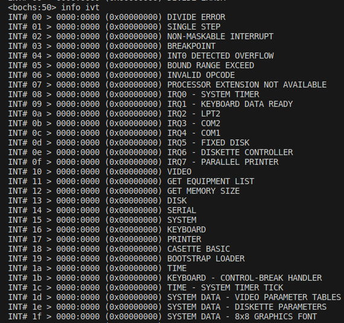

info flags|eflags 显示状态寄存器，其实在用 r 命令显示寄存器值时也会输出 eflags 的状态，还会输出
通用寄存器的值，我通常会用 r 来看。
sreg 显示所有段寄存器的值。
dreg 显示所有调试寄存器的值。
creg 显示所有控制寄存器的值。
info tab 显示页表中线性地址到物理地址的映射。
page line_addr 显示线性地址到物理地址间的映射。

## 硬盘介绍

### 硬盘发展简史

硬盘发展到今天，这几十年来都是靠容量不断提升才打败竞争对手存活下来的。可是速度一直是其最大的敌人，家用电脑 10 年前硬盘主流转速是 7200 转/分钟，今天依然如此。硬盘的随机存取是靠磁头臂不断移动实现的，磁头臂移动到目标位置的时间称为寻道时间，如果存储的数据不连续，这一块那一片的，磁头就得不断调整位置，这是机械式硬盘不可避免的，这便是硬盘的瓶颈所在，所以一般的硬盘都将寻道时间作为重要参数。

### 硬盘工作原理

左边的主轴上有两个盘片，其实不止两个，这里示意性地只画了两个。盘片固定在主轴上随主轴高速转动，目前主流个人电脑硬盘上的转速是 7200 转/分钟。每个盘片分上下两面，每面都存储数据，每个盘面都各由一个磁头来读取数据，故一个盘片上对应 2 个磁头。由于盘面与磁头是一一对应的关系，故用磁头号来表示盘面。磁头编号从上到下以 0 开始计数，所以用磁头 0 代表第一个盘面。磁头不会自己在盘片上移动，它需要被固定在右边的磁头臂上，在磁头臂的带动下，沿着盘片边缘向圆心的方向来回摆动，注意，摆动的轨迹是个弧，并不是绝对径向地直来直去。一方面这是因为磁头臂是由步进电机驱动的，磁头臂一端是步进电机主轴，另一端是磁头。步进电机每次都会转动一个角度，所以带动磁头臂在“画圆”，而磁头位于磁头臂的另一端，所以也跟着呈钟摆运动，运动轨迹是个弧线，并不是直线。所以，图 3-28 中磁头臂中标注了“类似于”径向运动，这就是“似”的原因。另一方面，磁头读取数据也不需要做直来直去的移动，能否找到数据，只跟它最终落点有关，和中间路径形状是没关系的。所以，一方面盘片的自转，另一方面磁头的摆动，这两种动作的合成，使磁头能够读取盘片任意位置的数据。

说完了硬盘内部各部件的运动，再说下存储逻辑。盘片表面是用于存储数据的磁性介质，为了更有效管理磁盘，这些磁性介质也被“格式化”成易于管理的格局，即将整个盘面划分为多个同心环，以圆心画扇形，扇形与每个同心环相交的弧状区域作为最基本的数据存储单元。这个同心环就称为磁道，而同心环上的弧状区域是扇形的一部分，故称之为扇区，它作为我们向硬盘存储数据的最基本单位，大小是 512 字节。我们写入的数据最终是写进了磁道上的扇区中。注意啦，我上面说的磁道是个环，不是线，线上可无法存储数据，
“环”是有横截面的，数据就存储这些“面积”中。磁头臂带动磁头在盘片上方移动，就是在找磁道的位置，盘片高速自转，就是在磁道内定位扇区。

磁道的编号和磁头一样也是从 0 开始的。相同编号的磁道组成的管状区域就称为柱面。图 3-28 中，两个盘片上编号相同的磁道，它们之间用灰色直线连接起来的部分，很像柱子的弧形表面，所以称柱面。

机械式硬盘的寻道时间是整个硬盘的瓶颈，为了减少寻道时间，就尽量在存储上下工夫。寻道，简而言之就是磁头在磁道间跳转，跳转所需要的时间称为寻道时间。如果待写入的数据小于一个磁道的剩余容量，将来再读出来的时候，磁头只定位到该磁道就行了。这时候的寻道只是一次。如果待写入的数据要占用多个磁道时，除了写的时候要变换磁头到新磁道，将来读出来的时候也需要变换磁道，也就是需要多次寻道才能完成数据的完整读写。既然寻道对机械式硬盘速度影响较大，那原则上就尽量减少寻道次数。于是按柱面存取的想法就诞生了：柱面中的磁道是相同编号，编号相同则意味着磁道在盘面上的位置相同，要定位到同一柱面中的磁道，所有磁头位置都一样，于是磁头不用再移动了。

按照这种想法写数据：当 0 面上的某磁道空间不足时，其他数据写入第 1 面相同编号的磁道上。若新磁道空间还是不足，再写第 2 面相同编号的磁道上，直到同一柱面上的磁道（所有盘面上的编号相同的磁道）都不够用时才会写到新的柱面上。所以，在这一点上，盘面越多，硬盘越快。

扇区编号与盘面和磁道不同，各磁道内的扇区是以 1 为起始编号的，并且只限于本磁道内有效，所以各个磁道间的扇区编号都相同，下限都是以 0 起，上限就不一定了，取决于各厂商的工艺，不过大多数情况下一个磁道中有 63 个扇区。磁头如何找到所需要的扇区呢？扇区是有自己的“头部”，头部之后的部分才是存储数据的 512 字节。头部中包含了扇区自身的信息，哪些信息能唯一定位一个扇区呢？答案是磁头号、磁道号和扇区号。

CPU 是怎样和硬盘打交道的呢?换句话说，针对硬盘的 IO 接口是什么？答案就是硬盘控制器。

硬盘控制器同硬盘的关系，如同显卡和显示器一样，它们都是专门驱动外部设备的模块电路，CPU 只同它们说话，由它们将 CPU 的话转译给外部设备。这是它们的共同点，但不同的是显卡和显示器是分开的，硬盘控制器和硬盘是连接在一起的，至少在我接触计算机以来一直就是这样的，从未变过，也不曾怀疑过。但我有天被告知，在很久很久以前，硬盘控制器和硬盘也是分开的，就像显卡和显示器一样。显示器太大了，怎么能装在机箱里呢，当然要和显卡分开了。可硬盘控制器和硬盘都那么小，为什么还要分开呢？

是啊，为什么呢，我也不知道，可它们在很久以前就是分开的。后来业界的几个老大合作开发出一种新的接口，这样才将硬盘和硬盘控制器整合在一起，为了突显“整合”之意，硬盘控制器和硬盘终于在一起了，这种接口便称为集成设备电路（Integrated Drive Electronics，IDE）。随着 IDE 接口标准的影响力越来越广泛，全球标准化协议将此接口使用的技术规范归纳成为全球硬盘标准，这样就产生了 ATA（Advanced
Technology Attachment）。不过由于 IDE 这个名字已经叫开了，所以大家依然习惯称硬盘为 IDE 硬盘。计算机发展非常快，新老交替的现象层出不穷，以至于后辈的出现常常把前辈的名字都给改了。这不，前几年刚出道的硬盘串行接口（Serial ATA，SATA）
，由于其是串行，所以之前的 ATA 接口只好称为并行 ATA，即（Parallel ATA，PATA）。

以前一般的主机只支持 4 个并口硬盘，但自从出现串口硬盘后，情况就变了，支持多少块硬盘，取决于主板的能力。有的主板同时兼容这两种接口，如图 3-29 所示。

图中 6 个并排的小接口都是 SATA，插槽里面呈字符 L 形，这就是它的标志。左边的长方形，里面有好多针的接口是 PATA 接口，也就是之前传统的硬盘是插在此接口上面的。下面把两个接口对应的线缆贴出来对比一下，如图 3-30 所示。

这两种线缆完全不同，左边 PATA 接口的线缆也称为 IDE 线，一个 IDE 线上可以挂两块硬盘，一个是主盘（Master），一个是从盘（Slave）。标有“主板插口”的那一头要插在图 3-29 中 PATA 接口处。在之前，主盘从盘的分工很明显，很多工作都要以主盘为主，比如系统就要装在主盘上。到后来系统兼容性越来越好，以至区别不明显了。前面说过了，一个主板支持这样的 4 块 IDE（PATA）硬盘，所以主板上提供两个 IDE 插槽。这两个接口也是以 0 为起始编号的，一个称为 IDE0，另一个称为 IDE1。不过按 ATA 的说法，这两个插槽称为通道，IDE0 叫作 Primary 通道，IDE1 叫作 Secondary 通道。即使主板上安装的是 SATA硬盘，它也兼容 PATA 的编程接口，向上兼容是计算机能源源不断向前发展的根基。所以，后面给出的端口号也将按照 PATA 这两个通道来分组给出。多说一句，这里所说的主盘 master、从盘 slave 别和 Primary 通道、Secondary 通道搞混了，通道是channel，不是 disk，每个通道上分别有主盘和从盘。

### 硬盘控制器端口

让硬盘工作，我们需要通过读写硬盘控制器的端口，端口就是位于 IO 控制器上的寄存器，此处的端口是指硬盘控制器上的寄存器。

端口可以被分为两组，Command Block registers 和 Control Block registers。Command Block registers用于向硬盘驱动器写入命令字或者从硬盘控制器获得硬盘状态，Control Block registers 用于控制硬盘工作状态。在 Control Block registers 组中的寄存器已经精减了，而且咱们基本上用不到，不说它们了，下面重点介绍 Command Block registers 组中的寄存器。

端口是按照通道给出的，也就是说，大家不要像我当初那样误以为端口是直接针对某块硬盘的，不是这样的，一个通道上的主、从两块硬盘都用这些端口号。要想操作某通道上的某块硬盘，需要单独指定。瞧，上面有个叫 device 的寄存器，顾名思义，指的就是驱动器设备，也就是和硬盘相关。不过此寄存器是8 位的，一个通道上就两块硬盘，指定哪一个硬盘只用 1 位就够了，寄存器可是很宝贝的资源，不能浪费，所以此寄存器是个杂项，很多设置都需集中在此寄存器中了，其中的第 4 位，便是指定通道上的主或从硬盘，0 为主盘，1 为从盘。

端口用途在读硬盘和写硬盘时还是有点区别的，比如拿 Primary 通道上的 0x1F1 端口来说，读操作时，若读取失败，里面存储的是失败状态信息，所以称为 error 寄存器，并且 0x1F2 端口中存储未读的扇区数。写操作时就变成了 feauture 寄存器，此寄存器用于写命令的参数。

data 寄存器在名字上我们就知道它是负责管理数据的，它相当于数据的门，数据能进，也能出，所以其作用是读取或写入数据。数据的读写还是越快越好，所以此寄存器较其他寄存器宽一些，16 位（已经很不错了，表中其他寄存器都是 8 位的）。在读硬盘时，硬盘准备好的数据后，硬盘控制器将其放在内部的缓冲区中，不断读此寄存器便是读出缓冲区中的全部数据。在写硬盘时，我们要把数据源源不断地输送到此端口，数据便被存入缓冲区里，硬盘控制器发现这个缓冲区中有数据了，便将此处的数据写入相应的扇区中。

读硬盘时，端口 0x171 或 0x1F1 的寄存器名字叫 Error 寄存器，只在读取硬盘失败时有用，里面才会记录失败的信息，尚未读取的扇区数在 Sector count 寄存器中。在写硬盘时，此寄存器有了别的用途，所以有了新的名字，叫 Feature 寄存器。有些命令需要指定额外参数，这些参数就写在 Feature 寄存器中。强调一下，error 和 feature 这两个名字指的是同一个寄存器，只是因为不同环境下有不同的用途，为了区别这两种用途，所以在相应环境下有不同的名字。这两个寄存器都是 8 位宽度。

Sector count 寄存器用来指定待读取或待写入的扇区数。硬盘每完成一个扇区，就会将此寄存器的值减 1，所以如果中间失败了，此寄存器中的值便是尚未完成的扇区。这是 8 位寄存器，最大值为 255，若指定为 0，则表示要操作 256 个扇区。

硬盘中的扇区在物理上是用“柱面-磁头-扇区”来定位的（Cylinder Head Sector）
，简称为 CHS，但每次我们要事先算出扇区是在哪个盘面，哪个柱面上，这太麻烦了，这对于磁头来说很直观，它就是根据这些信息来定位扇区的。可是咱们还是希望有一套对人来说较直观的寻址方法，我们希望磁盘中扇区从 0 开始依次递增编号，不用考虑扇区所在的物理结构。其实我在描述需求时已经说出了 LBA 的定义，这是一种逻辑上为扇区址的方法，全称为逻辑块地址（Logical Block Address）。

LBA 有两种，一种是 LBA28，用 28 位比特来描述一个扇区的地址。最大寻址范围是 2 的 28 次方等于 268435456 个扇区，每个扇区是 512 字节，最大支持 128GB。我们采用LBA28 模式。由于 128GB 已经不能满足日益增长的存储需求，硬盘越来越大了，得有相匹配的寻址方法与之配套，于是要介绍的另外一种是 LBA48，用 48 位比特来描述一个扇区的地址，最大可寻址范围是 2 的 48 次方，等于 281474976710656 个扇区，乘以 512 字节后，最大支持 131072TB，即 128PB。

介绍完了 LBA，现在可以说 LBA 寄存器了，这里有 LBA low、LBA mid、LBA high 三个，它们三个都是 8 位宽度的。LBA low 寄存器用来存储 28 位地址的第 0～7 位，LBA mid 寄存器用来存储第 8～15 位，LBA high 寄存器存储第 16～23 位。哎？三个 8 位的加起来才 24 位，连 LBA28 都不够，咱们怎么用呢？有问题就有解决方案，这就引出了下一个寄存器，device 寄存器。

device 寄存器是个杂项，它的宽度是 8 位。在此寄存器的低 4 位用来存储 LBA 地址的第 24～27 位。结合上面的三个 LBA 寄存器。第 4 位用来指定通道上的主盘或从盘，0 代表主盘，1 代表从盘。第 6 位用来设置是否启用 LBA 方式，1 代表启用 LBA 模式，0 代表启用 CHS 模式。另外的两位：第 5 位和第 7 位是固定为 1 的，称为 MBS 位。

在读硬盘时，端口 0x1F7 或 0x177 的寄存器名称是 Status，它是 8 位宽度的寄存器，用来给出硬盘的状态信息。第 0 位是 ERR 位，如果此位为 1，表示命令出错了，具体原因可见 error 寄存器。第 3 位是 datarequest 位，如果此位为 1，表示硬盘已经把数据准备好了，主机现在可以把数据读出来。第 6 位是 DRDY，表示硬盘就绪，此位是在对硬盘诊断时用的，表示硬盘检测正常，可以继续执行一些命令。第 7 位是 BSY位，表示硬盘是否繁忙，如果为 1 表示硬盘正忙着，此寄存器中的其他位都无效。

在写硬盘时，端口 0x1F7 或 0x177 的寄存器名称是 command，和上面说过的 error 和 feature 寄存器情况一样，只是用途变了，所以换了个名字表示新的用途，它和 status 寄存器是同一个。此寄存器用来存储让硬盘执行的命令，只要把命令写进此寄存器，硬盘就开始工作了。在咱们的系统中，主要使用了三个命令。

（1）identify：0xEC，即硬盘识别。

（2）read sector：0x20，即读扇区。

（3）write sector：0x30，即写扇区。

总结下寄存器 error、feature 和 status、command，大家可以这样来助记：这两组都是同一寄存器（也就是同一端口）多个用途，对同一端口写操作时，硬盘控制器认为这是个命令，对同一端口读操作时，硬盘控制器认为是想获得状态。

### 常用的硬盘操作方法

最主要的顺序就是 command 寄存器一定得是最后写，因为一旦 command 寄存器被写入后，硬盘就开始干活啦，它才不管其他寄存器中的值对不对，一律拿来就用，有问题的话报错就好啦。其他寄存器顺序不是很重要。

约定个操作顺序：

（1）先选择通道，往该通道的 sector count 寄存器中写入待操作的扇区数。
（2）往该通道上的三个 LBA 寄存器写入扇区起始地址的低 24 位。
（3）往 device 寄存器中写入 LBA 地址的 24～27 位，并置第 6 位为 1，使其为 LBA 模式，设置第 4
位，选择操作的硬盘（master 硬盘或 slave 硬盘）。
（4）往该通道上的 command 寄存器写入操作命令。
（5）读取该通道上的 status 寄存器，判断硬盘工作是否完成。
（6）如果以上步骤是读硬盘，进入下一个步骤。否则，完工。
（7）将硬盘数据读出。

硬盘工作完成后，它已经准备好了数据，咱们该怎么获取呢？一般常用的数据传送方式如下。
（1）无条件传送方式。
（2）查询传送方式。
（3）中断传送方式。
（4）直接存储器存取方式（DMA）。
（5）I/O 处理机传送方式。

对于上面的第 1 种“无条件传送方式”，应用此方式的数据源设备一定是随时准备好了数据，CPU 随时取随时拿都没问题，如寄存器、内存就是类似这样的设备，CPU 取数据时不用提前打招呼。

第 2 种“查询传送方式”，也称为程序 I/O、PIO（Programming Input/Output Model），是指传输之前，由程序先去检测设备的状态。数据源设备在一定的条件下才能传送数据，这类设备通常是低速设备，比CPU 慢很多。CPU 需要数据时，先检查该设备的状态，如果状态为“准备好了可以发送”，CPU 再去获取数据。硬盘有 status 寄存器，里面保存了工作状态，所以对硬盘可以用此方式来获取数据。

第 3 种“中断传送方式”，也称为中断驱动 I/O。上面提到的“查询传送方式”有这样的缺陷，由于 CPU需要不断查询设备状态，所以意味着只有最后一刻的查询才是有意义的，之前的查询都是发生在数据尚未准备好的时间段里，所以说效率不高，仅对于不要求速度的系统可以采用。可以改进的地方是如果数据源设备将数据准备好后再通知 CPU 来取，这样效率就高了。通知 CPU 可以采用中断的方式，当数据源设备准备好数据后，它通过发中断来通知 CPU 来拿数据，这样避免了 CPU 花在查询上的时间，效率较高。

第 4 种“直接存储器存取方式（DMA）”。在中断传送方式中，虽然极大地提高了 CPU 的利用率，但通过中断方式来通知 CPU，CPU 就要通过压栈来保护现场，还要执行传输指令，最后还要恢复现场。似乎有同学说此方式已经很爽了，你还想怎样？哈哈，其实更爽的是一点都不要浪费 CPU 资源，不让 CPU参与传输，完全由数据源设备和内存直接传输。CPU 直接到内存中拿数据就好了。这就是此方式中“直接”的意思。不过 DMA 是由硬件实现的，不是软件概念，所以需要 DMA 控制器才行。

第 5 种“I/O 处理机传送方式”。不知大家发现了没有，在说上面每一种的时候都把它们各自说得特别好，似乎完美不可替代了。DMA已经借助其他硬件了，CPU 已经很轻松了，难道还有更爽的方式？是啊，DMA 方式中 CPU 还嫌爽的不够，毕竟数据输入之后或输出之前还是有一部分工作要由 CPU 来完成的，如数据交换、组合、校验等。如果 DMA 控制器再强大一点，把这些工作帮 CPU 做了就好了。也是哦，既然为了解放 CPU，都已经引用一个硬件（DMA）了，干脆一不做二不休，再引入一个硬件吧。于是，I/O 处理机诞生啦，听名字就知道它专门用于处理 IO，并且它其实是一种处理器，只不过用的是另一套擅长 IO 的指令系统，随时可以处理数据。有了 I/O 处理机的帮忙，CPU 甚至可以不知道有传输这回事，这下 CPU 才真正爽到家啦。同样，这也是需要单独的硬件来支持。

在我们的系统中，我们用了第 2、3 这两种软件传输方式。

## 让 MBR 使用硬盘

### 改造 MBR

MBR 是占据了硬盘的第 0 扇区（以逻辑 LBA 方式，扇区从 0 开始编号，若是以物理 CHS 方式，扇区则从 1 开始编号），第 1 扇区是空闲的，可以用，但离得太近总感觉不如隔开一点心里踏实，所以把loader 放到第 2 扇区。MBR 从第 2 扇区中把它读出来。读出来放到哪里呢？原则上是找个空闲地方就行了，在表 1-1“实模式下的内存布局”中查看下，只要在“用途”列中注明“可用区域”的地方都可以用。0x500～0x7BFF 和 0x7E00～9FBFF 这两段内存区域都可以。

首先，loader 中要定义一些数据结构（如 GDT 全局描述符表），这些数据结构将来的内核还是要用的，所以 loader 加载到内存后不能被覆盖。

其次，随着咱们不断添加功能，内核必然越来越大，其所在的内存地址也会向越来越高的地方发展，难免会超过可用区域的上限，咱们尽量把 loader 放在低处，多留出一些空间给内核。

所以，我将 loader 的加载地址选为 0x900。为什么不是 0x500，这个多省空间？还是预留出一定空间吧，彼此隔开远一点心里才踏实，不差这点空间了，哈哈，完全是个人偏好，大家随意啦。

